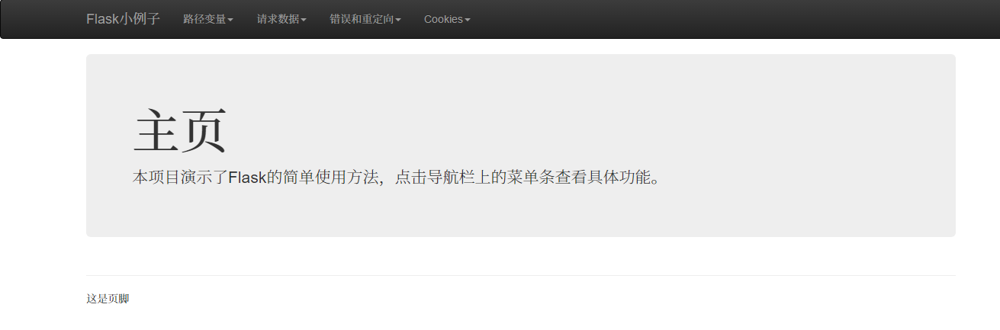

# python-study

我的Python学习代码。

## python-samples

Python语言和一些第三方类库的简单示例。

## flask-sample

添加了flask的简单例子，演示了基本使用方法。

## scrapy_sample

添加了Scrapy爬虫框架的例子。

## introducing-python-answers

《python语言及其应用》的习题答案。

## empireofcode

[Empire of Code](https://checkio.org/)的一些答案。

## checkio

[checkio](https://checkio.org/)的一些答案。

## tieba-tools

一点点百度贴吧工具，以后会慢慢补充。

## crawling-samples

简单的爬虫例子集合。
